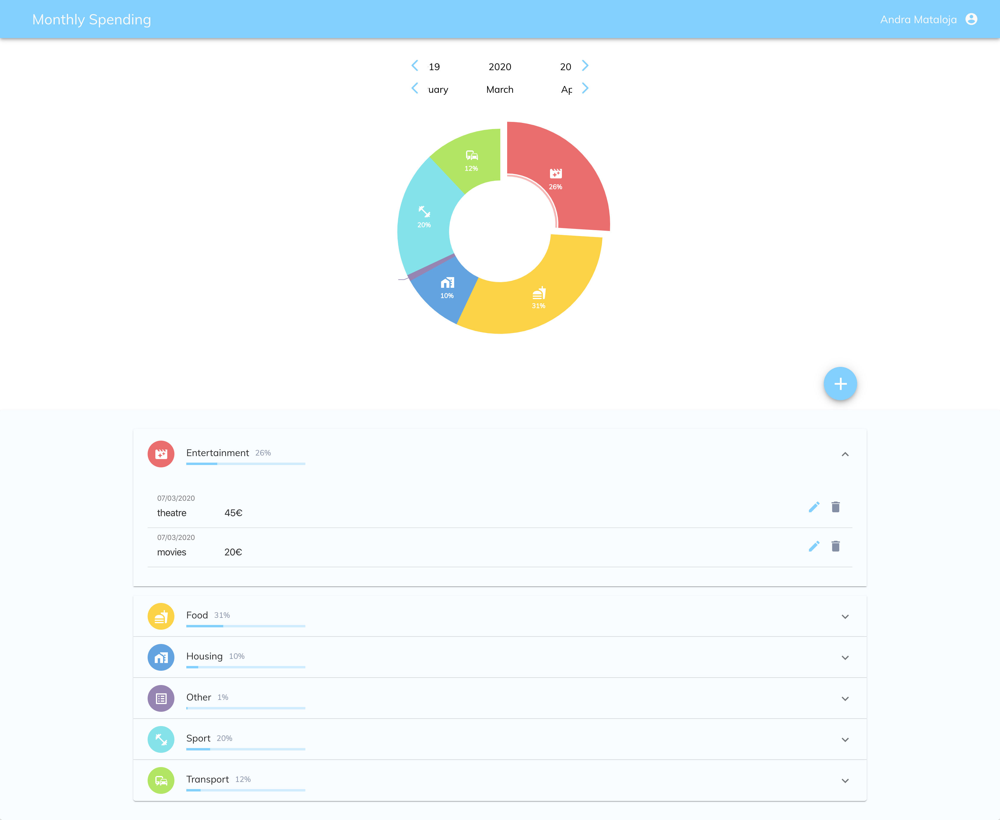

# Expense-tracker

Application for tracking monthly expenses. Add, delete, update expenses and see data visualization by categories on chart.  

# Running locally

Go to [Auth0](https://auth0.com/) and sign up. Create an application and get your domain and client ID key.(Tutorial on the Auth0 page) 

After that create .env file in Client folder and add lines to the file: 

REACT_APP_AUTH0_DOMAIN=YOUR_AUTH0_DOMAIN

REACT_APP_AUTH0_CLIENT_ID=YOUR_AUTH0_CLIENT_ID

To run server application go to /server, for client go to /client and follow the instructions there.
